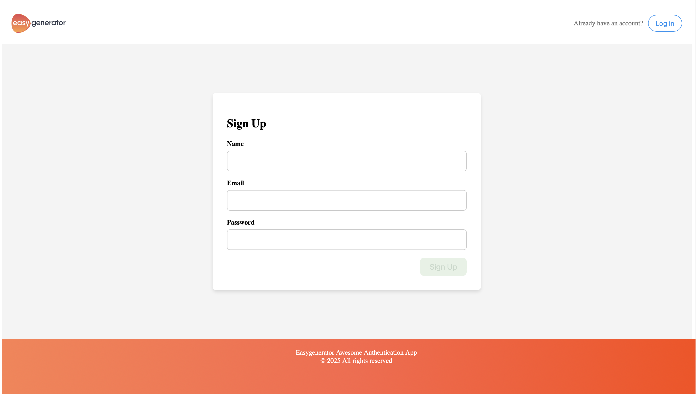
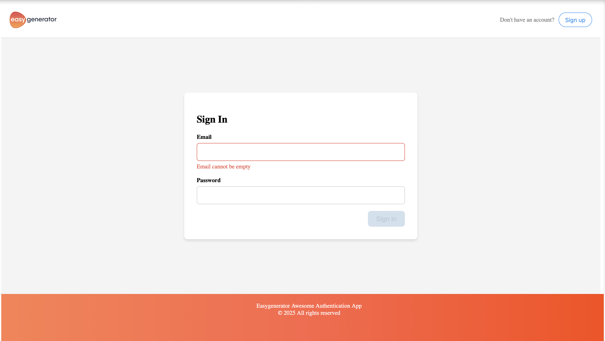
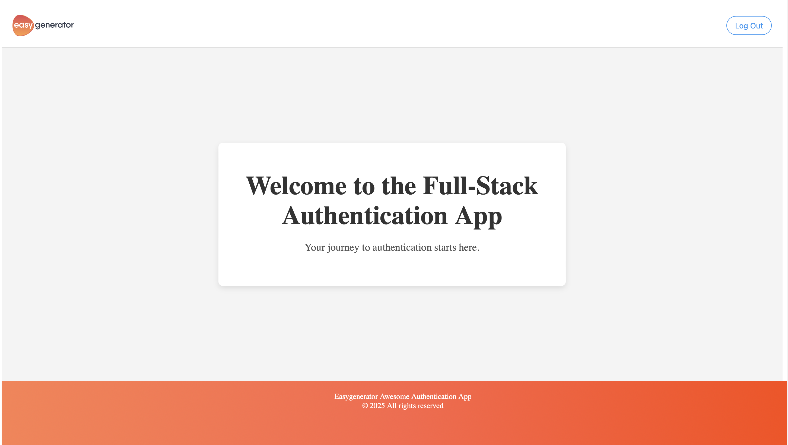

# Easygenerator Full Stack Test Task

This repository contains a full-stack authentication application developed as part of the **Easygenerator Full Stack Test Task**. The project consists of a frontend built with **React** and **TypeScript** using **Vite**, and a backend built using **NestJS**, **MongoDB**, and **JWT** for secure authentication.

## Overview

This application enables users to securely register, log in, and access protected resources. It demonstrates best practices for authentication, security, validation, and robust error handling.

## Features

### Frontend

- **User Registration (Sign-Up)**:
  - Collects and validates user details (name, email, password).
  - JWT tokens stored securely in local storage upon successful registration.
  - Redirects to Sign-in page after successful registration.

- **User Authentication (Sign-In)**:
  - Allows registered users to log in using JWT tokens.
  - Provides client-side validation and clear error feedback.

- **Protected Landing Page**:
  - Accessible only to authenticated users.
  - Displays a welcome message and user details.

- **404 Page**:
  - Custom-designed page for undefined routes.

- **Responsive UI and Form Validation**:
  - Validates inputs for email format, password strength, and name.


### Backend

- **JWT-based Authentication**:
  - Secure handling of JWT tokens using Passport.js.
  - Token generation on successful sign-in/sign-up.

- **User Management**:
  - Secure storage of user credentials with bcrypt password hashing.
  - Robust validation of user inputs using class-validator.

- **Protected Endpoint**:
  - `/profile` endpoint that returns user's profile data based on JWT token.

- **Logging Module**:
  - Integrated logging using NestJS built-in Logger for monitoring authentication events and errors.

- **Comprehensive Error Handling**:
  - Consistent and clear API responses with appropriate HTTP status codes and descriptive error messages.


## Tech Stack

### Frontend
- **React & TypeScript**
- **Vite** for bundling
- **Axios** for data fetching

### Backend
- **NestJS**
- **MongoDB** (with Mongoose, for interacting with database )
- **JWT (JSON Web Tokens)**
- **Passport.js**
- **Bcryptjs**


## Getting Started

### Backend Setup

1. Clone the repository:

```bash
git clone https://github.com/alyzain/easygenerator-full-stack-test-task.git
```

2. Navigate to the server directory:

```bash
cd server
```

3. Install dependencies:

```bash
npm install
```

4. Configure environment variables (`.env`):

```env
MONGODB_URI=mongodb://localhost:27017/easygenerator
JWT_EXPRIES=2h
JWT_SECRET=alyzain
BCRYPT_SALT_ROUNDS=10
```

5. Start the backend server:

```bash
npm run start:dev
```

### Frontend Setup

1. Navigate to the client directory:

```bash
cd ../client
```

2. Install dependencies:

```bash
npm install
```

3. Start the frontend server:

```bash
npm run dev
```

4. Access the application at `http://localhost:5173`

## API Endpoints

- `POST /auth/signup` - User registration
- `POST /auth/signin` - User login
- `GET /profile` - Protected user profile information [For d]

### Example CURL Commands

```bash
# Signin example
curl --location 'http://localhost:3000/auth/signin' \
--header 'Content-Type: application/json' \
--data-raw '{
    "email": "alyahmedzain23@gmail.com",
    "password": "Testing23$"
}'

# Profile example
curl --location 'http://localhost:3000/auth/signin' \
curl --location 'http://localhost:3000/profile' \
--header 'Content-Type: application/json' \
--header 'Authorization: Bearer token' \
--data ''
```


## Future Improvements

- **Password Reset Functionality**
- **Email Verification**
- **Role-Based Access Control**
- **Swagger API Documentation**
- **Unit and Integration Testing (Jest)**
- **Dockerization and CI/CD Integration**

## Screenshots

- **Sign Up Page**:



- **Sign In Page**:



- **Landing Page**:



- **404 Page**:


---

Built with ❤️ by [Aly Zain](https://github.com/alyzain)
