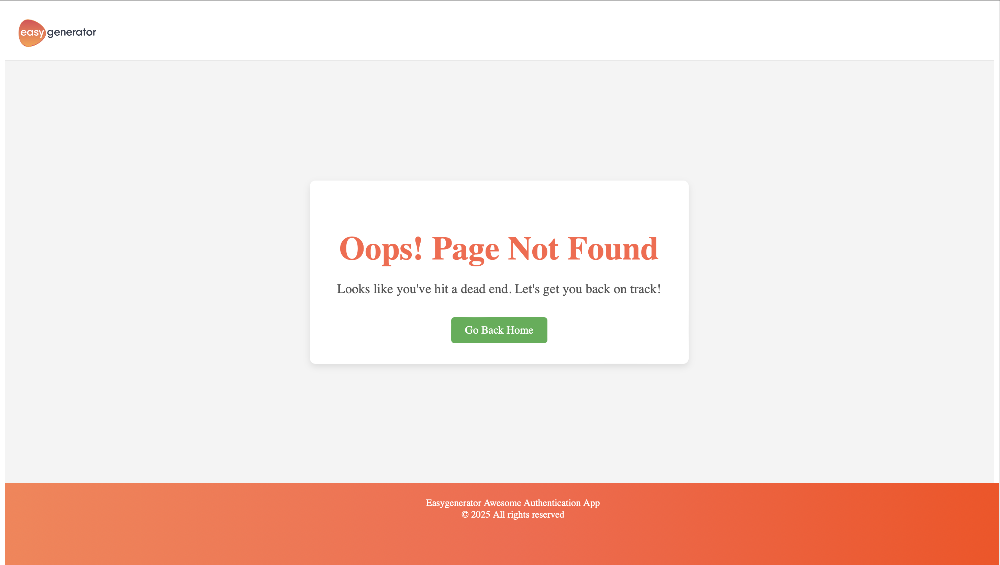

# Easygenerator Full Stack Test Task

This repository contains a full-stack authentication application developed as part of the **Easygenerator Full Stack Test Task**. The project consists of a frontend built with **React** and **TypeScript** using **Vite**, and a backend built using **NestJS**, **MongoDB**, and **JWT** for secure authentication.

---

## Overview

This application enables users to securely register, log in, and access protected resources. It demonstrates best practices for authentication, security, validation, and robust error handling.

---

## Features

### Frontend

- **User Registration (Sign-Up)**:
  - Collects and validates user details (name, email, password).
  - JWT tokens stored securely in local storage upon successful registration.
  - Redirects to Sign-in page after successful registration.

- **User Authentication (Sign-In)**:
  - Allows registered users to log in using JWT tokens.
  - Provides client-side validation and clear error feedback.

- **Protected Landing Page**:
  - Accessible only to authenticated users.
  - Displays a welcome message and user details.
  - Redirects to the Sign-In page if the user is not authenticated.

- **404 Page**:
  - Custom-designed page for undefined routes.

- **Responsive UI and Form Validation**:
  - Validates inputs for email format, password strength, and name.

---

### Backend

- **JWT-based Authentication**:
  - Secure handling of JWT tokens using Passport.js.
  - Token generation on successful sign-in/sign-up.

- **User Management**:
  - Secure storage of user credentials with bcrypt password hashing.
  - Robust validation of user inputs using class-validator.

- **Protected Endpoint**:
  - `/profile` endpoint that returns user's profile data based on JWT token.

- **Logging Module**:
  - Integrated logging using NestJS built-in Logger for monitoring authentication events and errors.

- **Comprehensive Error Handling**:
  - Consistent and clear API responses with appropriate HTTP status codes and descriptive error messages.

- **Swagger API Documentation**:
  - Provides detailed API documentation for all endpoints.
  - Accessible at `http://localhost:3000/docs`.

- **Unit Tests for Auth Module**:
  - Includes units tests for the Auth Controller and Services to ensure proper functionality and reliability.

---

## Tech Stack

### Frontend
- **React & TypeScript**
- **Vite** for bundling
- **Axios** for data fetching

### Backend
- **NestJS**
- **MongoDB** (with Mongoose, for interacting with database)
- **JWT (JSON Web Tokens)**
- **Passport.js**
- **Bcryptjs**

---

## Dockerized Setup
The project has been fully Dockerized for easier deployment and management. It includes three services:
- **MongoDB**: Database service.
- **Server**: Backend service built with NestJS.
- **Client**: Frontend service built with React.

Additionally, a dedicated test service is included to run unit tests for the backend authentication module, ensuring reliability and correctness.

### Prerequisites
- Install **Docker** and **Docker Compose** on your machine.

---

### Running the Application with Docker

1. Clone the repository:
   ```bash
   git clone https://github.com/alyzain/easygenerator-full-stack-test-task.git
   ```

2. Navigate to the project directory:
   ```bash
   cd easygenerator-full-stack-test-task
   ```

3. Create a `.env` file in the **root directory**:
   ```plaintext
   MONGODB_URI=mongodb://mongo:27017/easygenerator
   JWT_EXPRIES=2h
   JWT_SECRET=37b641de01b2663ece4ee155ab413af1c7c8e8257275a8acbb30bacadfc63779
   BCRYPT_SALT_ROUNDS=10
   ```

4. Build and start the containers:
   ```bash
   docker-compose up --build
   ```

5. Access the application:
   - **Frontend**: `http://localhost:5173`
   - **Backend**: `http://localhost:3000`
   - **API Documentation** `http://localhost:3000/docs`

---


### Frontend Routes

- `/signup` - User registration page
- `/signin` - User login page
- `/landing` - Protected landing page for authenticated users
- `/*` - 404 page for undefined routes

---

## API Endpoints

- `POST /auth/signup` - User registration
- `POST /auth/signin` - User login
- `GET /users/profile` - Protected user profile information

---

### Swagger API Documentation
Access detailed API documentation at:
```
http://localhost:3000/docs
```

---

## Unit Tests

Unit tests have been added to ensure the reliability of the backend services. Run the tests using:
```bash
docker-compose up test
```

---

## Example CURL Commands

```bash
# Signin example
curl --location 'http://localhost:3000/auth/signin' \
--header 'Content-Type: application/json' \
--data-raw '{
    "email": "alyahmedzain23@gmail.com",
    "password": "Testing23$"
}'

# Profile example
curl --location 'http://localhost:3000/users/profile' \
--header 'Content-Type: application/json' \
--header 'Authorization: Bearer <token>'
```

---

## Screenshots

- **Sign Up Page**:


- **Sign In Page**:


- **Landing Page**:


- **404 Page**:



---

## Built With ❤️ by [Aly Zain](https://github.com/alyzain)
